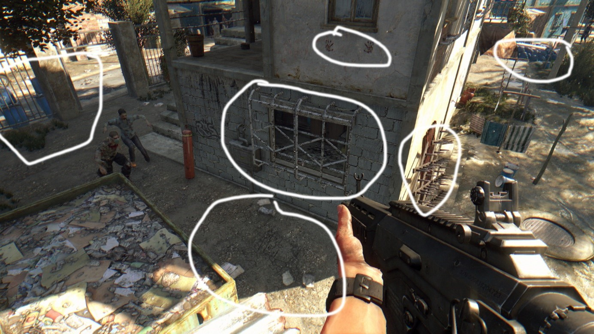
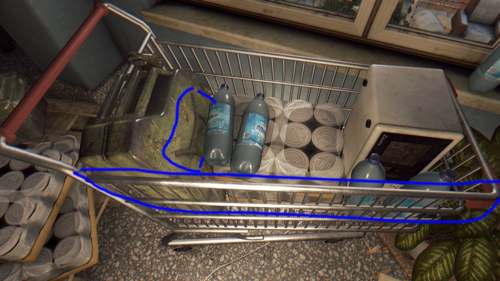
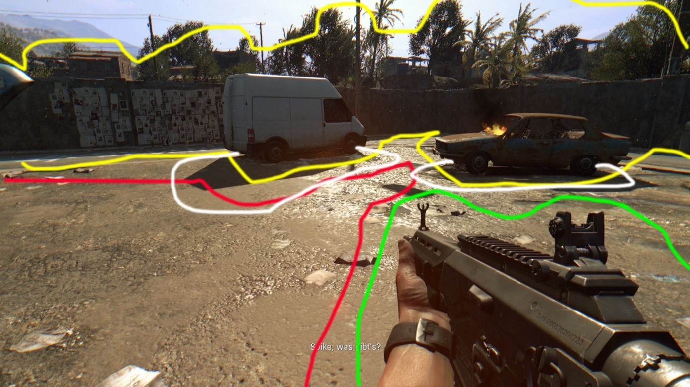
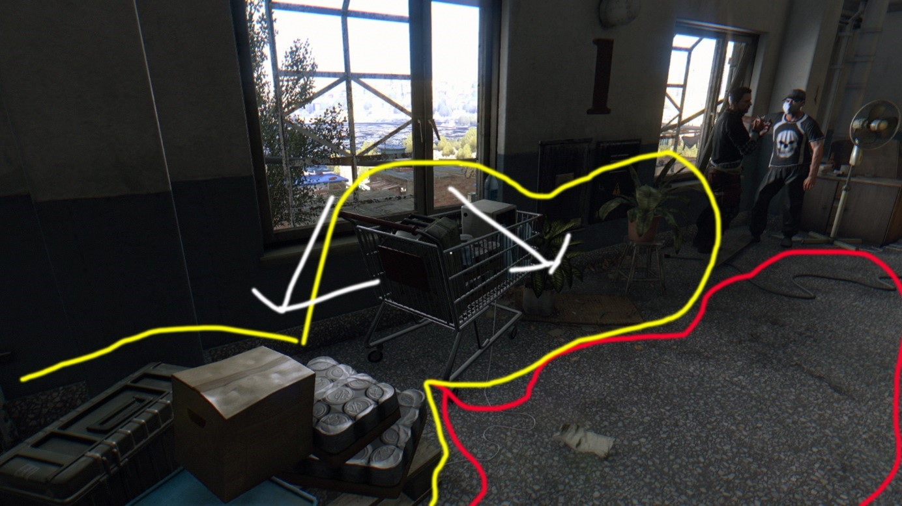
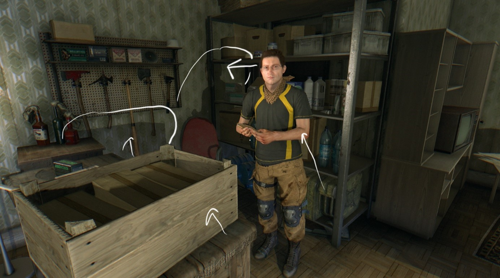
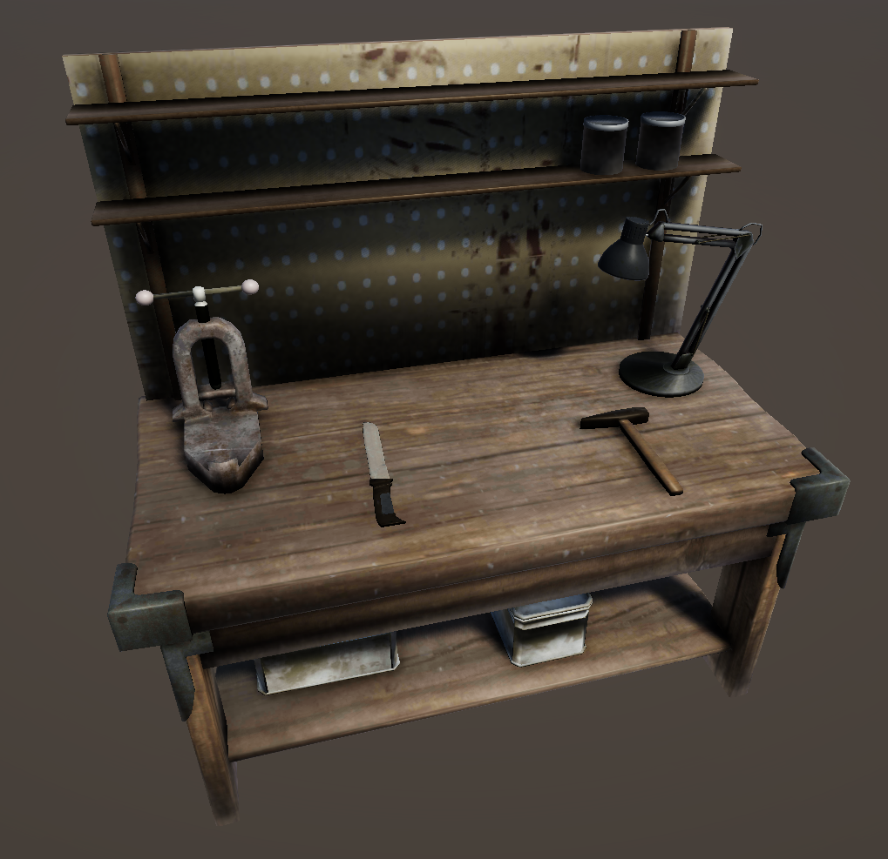
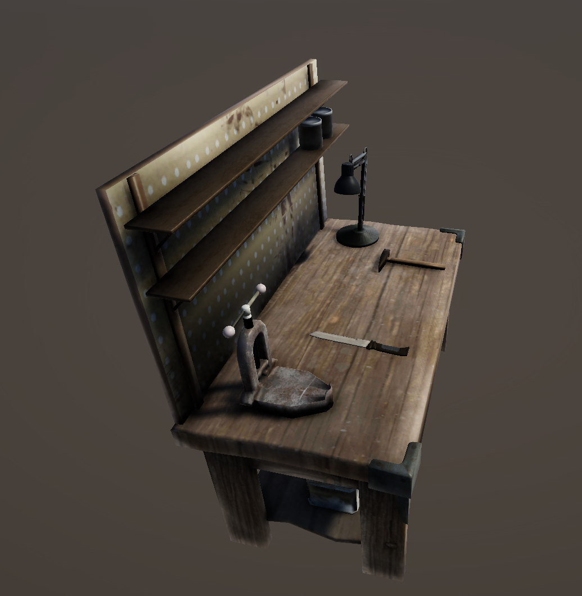
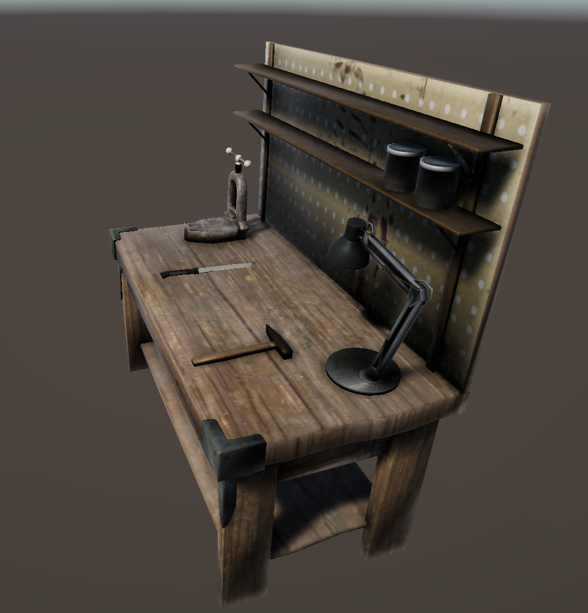
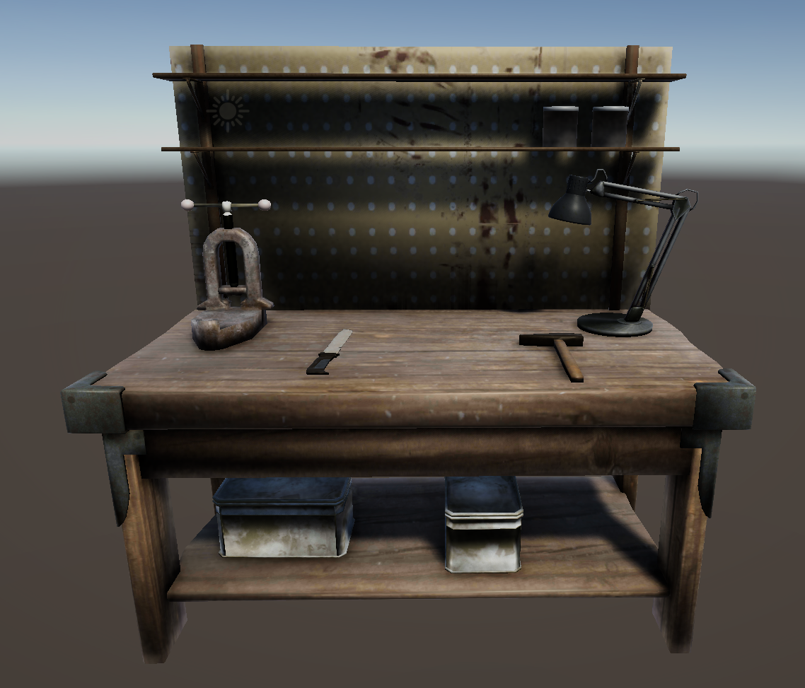

# Abgabe Digital Asset Creation for Games: Working station - Dying-Light

Dieses Repository beinhaltet die Abgabe der Veranstaltung Digital Asset Creation for Games (DACG) aus dem Sommersemester 2021. Inhalt dieses Wahlpflichtmoduls war es, für ein beliebiges Spiel ein Asset zu erstellen, das nahtlos in das Spiel eingebunden werden kann. Es konnte dabei ein neues oder ein bestehendes Asset sein.
Gewünscht war es, den Stil und die Art und Weise wie der Art-Stil des Spiels umgesetzt zu analysieren und im eigen angefertigten Asset wiedergeben.

## Game-Loock-Analyse Dying Light

### Konzept

Dying Light ist ein First Person Survival Action-RPG, das ist einer fiktiven Stadt in der Türkei am Meer spielt. Man befindet sich während der gesamten Spielzeit in einer Zombie Apokalypse, die das Setting der Szenerie maßgeblich bestimmt. 

      <figure>
        
        <figcaption>Bild 01r</figcaption>
      </figure>

So sind zum Beispiel viele Fenster vergittert oder gar mit Möbeln zugemauert. (weiße Umrandung m.) Es wurden Fallen, wie die Spikes (weiße Umrandung rechts) aufgestellt, um das Eindringen der Zombies zu verhindern und diese zu töten. Häufig sind Blutspuren oder blutige Handabdrücke an Hauswänden oder auf dem Boden vorzufinden (weiße Umrandung o.). Des Weiteren sorgen Berge von Müllbeutel und vereinzelten Mülltüten oder Verpackungen auf dem Boden dafür, dass sich niemand länger darum kümmern konnte Ordnung in die Stadt zu bringen.

### Visualität und Technik

<table>
  <tr>
    <td>
      <figure>
         
        <figcaption>Bild 02</figcaption>
      </figure>
    </td>
    <td>
      <figure>
         
        <figcaption>Bild 03</figcaption>
      </figure>
    </td>
  </tr>
  <tr>
    <td>
      <figure>
         
        <figcaption>Bild 03</figcaption>
      </figure>
    </td>
    <td>
      <figure>
         
        <figcaption>Bild 05: Licht fällt in Pfeilrichtung auf NPC oder Gegenstand und wirft auf Wand Schatten</figcaption>
      </figure>
    </td>
  </tr>
</table>

Dying Light weist verschiedene Arten der Beleuchtung auf. Zum einen existiert außerhalb von Gebäuden eine zentrale Beleuchtung durch eine Sonne, die NPC und Gegenstände gerichtet bescheint und somit auch Schatten auf den Boden wirft. Dieser Schatten verändert sich, sobald der Spieler in die Scheinrichtung der Sonne geht. Ist die Sonne ,,aus“, ist es also dunkel, so sind auch alle weiteren Gegenstände dunkel und nur durch eine Taschenlampe, die der Spieler bei sich hat, sichtbar. Gegenstände an der Oberfläche besitzen somit keine Light Map.
Das Innere der Gebäude wird durch gerichtete Punktlichtquellen, wie zum Beispiel durch Lampen beleuchtet, die durch das Auftreffen auf NPCs und Gegenstände Schatten auf Wände oder Böden werfen. Zusätzlich scheint durch die Fenster oder Öffnungen an den Gebäuden Licht von außen ins Innere, dieses Licht wirft jedoch keine Schatten. Um in Hauptbereichen von Gebäuden eine gewisse zusätzliche Grundhelligkeit zu gewinnen, wirken die Objekte durch Light Maps zusätzlich heller. (siehe Bild 5)
Die Farben der Gegenstände wirken im Allgemeinen, passend zum Setting des Spiels, sättigungsarm und verbraucht. Der Farbeindruck der Gegenstände wirkt daher trostlos und passt zur Endzeitstimmung. Zudem wird viel mit Rost auf metallenen Texturen und mit Staub und Schmutz auf nicht metallischen Gegenständen gespielt das den Eindruck verstärkt, dass seit längerem an bestimmten Orten keine NPC waren, um diese Gegenstände zu pflegen.
Der Detailgrad von Texturen und die Oberflächenbeschaffenheit lässt sich gut in drei Ebenen einordnen. Da es ein First Person Spiel ist, befinden sich Gegenstände und Waffen sehr nahe an der Kamera des Spiels, wodurch diese Gegenstände eine hohe Texel Density und durch viele detailreiche Einkerbungen und komplexere Topologien eine Dichte an Details aufweisen (in Bild 3 durch grüne Einkreisung markiert). Eine Ebene tiefer liegen die Gegenstände der Open World und die, die man im Inneren von Gebäuden zu Sicht bekommt. Diese Gegenstände weißen eine geringere Texel Density und Komplexität der Topologie auf. Details wie zum Beispiel Schrauben an Lampen oder Erhebungen an dem Kanister in Bild 2 werden durch Normalmaps gelöst. Zudem wirken diese Texturen teilweise unschärfer als die der Waffe in Bild 3. Auf dieser Ebene wird zudem viel mit Rost oder Staub/ Dreck gearbeitet, um einen verfalleneren Eindruck zu erwecken. Rost an Hausdächern oder Schäden an Hauswänden werden auch entweder durch Normal- oder Bumpmaps gelöst. Teilweise auch durch Texturbilder (in Bild 3 und 4 durch gelbes Einkreisen markiert). 
Als letzte Ebene kann man den Boden werten, dieser ist am weitesten von der Kamera zu sehen und bedeckt auch den weitesten Teil der open World. Auf ihr werden Details wie Müll oder Blut nur durch Textur Bilder gelöst, die ohne Höhe, bzw. Tiefe auf dem Boden liegen. Gut zu erkennen ist es in Bild 3 im rot eingekreisten Bereich des Bildes. Sowohl der Müll als auch Erde oder Matschklumpen werden nur durch Texturen gelöst, die wiederum wie die Ebene 1 eine Texel Density und Auflösung aufweisen.

Die Texturen für Dying Light sind PBR.

Zusammenfassend kann man sagen, dass die Reduzierung der Farbsättigung und das Auftragen von Rost stilistisch zum Setting der Szenerie beitragen, sowie die Anpassung der Texel Density an die Entfernung der Kamera zu den entsprechenden Objekten. Abschließend wurde durch den Einsatz von verbarrikadierten Hauseingängen und Fenster und dem Aufstellen von Verteidigungsanlagen gegen Zombies dazu beigetragen, dass sich der Spieler inmitten einer Apokalypse befindet.

## Asset Paper zu einem „Dying Light“ stilistischen Gameasset

<table>
  <tr>
    <td>
      <figure>
        
      </figure>
    </td>
    <td>
      <figure>
        
      </figure>
    </td>
  </tr>
  <tr>
    <td>
      <figure>
        
      </figure>
    </td>
    <td>
      <figure>
        
      </figure>
    </td>
  </tr>
</table>

### Link zu Sketchfab

[Werkbank anschauen](https://sketchfab.com/3d-models/workingstation-dying-light-bcdee0989ab440cc939a3a475c36760f)

### Was ist es?

Das Gameasset ist eine Werkbank, die der Spieler in einem seiner vielen Safehäusern vorfindet, um daran seine Waffen zu reparieren. Auf dieser Werkbank befindet sich eine Lampe, die der Spieler bei dem Betreten einschaltet, um sich Licht zu machen. Darstellungsweise befindet sich eine Machete auf der Werkbank, die die Waffe des Spielers symbolisiert. Zudem kann der Spieler durch den Hammer, die Spindelpresse und dem Lack/Farbe/Kleber in den Dosen seine Waffe aufwerten oder bemalen.

### Eigenschaften des Tisches

Der Tisch ist aus massiven Holzplatten gebaut worden. Diese Holzplatten werden an den vorderen Kanten durch Metallschützern abgedeckt und vor Berührungsschäden geschützt. Die Tischplatten und auch die Holzrückwand sind zum einen durch vorangegangenes Benutzen des Spielers oder anderer NPC verschmutz und gleichwohl durch das lange unbenutzte rumstehen verstaubt. Die Tischschützer sind derweil ein bisschen angerostet. Zudem sind die Stützpfeiler und Tragflächen des Regals, das an den Tisch gebunden ist und vor der Rückwand steht auch leicht angerostet Dies könnte durch etweilige Wasserschäden oder Luftfeuchtigkeit, die durch offene Fenster oder Löcher in der Wand ins Innere des Safehauses eindringt, verurchsacht worden sein. Die Eckschützer sind jeweils auch mit Nieten an das Holz der Tischbeine und der Tischplatze befestigt, welche man anhand von Normalmaps visuell an die Oberfläche gebaket hat

### Eigenschaften der Machete

Die Machete hat an ihrer Klinge schon Nutzungsspuren und leichte, nicht mehr abwaschbare, Blutflecken. Die Kratzer an der Klinge könnten dadurch entstanden sein, dass getötete Zombies noch Kleidungsstücke oder Gegenstände ihrer noch lebenden Vorkörpereigenschaften tragen oder halten, die Kratzer auf der Waffe versucht haben. Außerdem wurde die Machete nicht in einer Fabrik gefertigt, sondern wurde auf beste Weise durch Handarbeit nachgebaut. Generell sind Waffen in dem Spiel eher prototypisch experimentell zusammengebaut oder geschweißt worden, wodurch ein nie perfektes Aussehen entstehen kann.

### Eigenschaften der Spindelpresse

Die Spindelpress kann noch ein Überbleibsel aus kleinen Fabrikhallen oder von Rettungsgütern während der Pandemie sein und hat durch viel Rumstehen auf dem Tisch und Warten darauf, dass sie von NPCs oder dem Spieler benutzt wird Rost abbekommen. Sie ist durch eine einfache Gussform entstanden und hat an ihrer Presse ein Gewinde, das keine richtige Textur besitzt, weil sie zum einen nur sehr klein in der Kamera zu sehen ist und daher keine zwingend hohe Face Zahl und Details benötigt um als solche dargestellt werden zu können. 

### Eigenschaften des Hammers

Der Spieler kann zusätzlich zu der Spindelpresse und den Lackeimern einen Hammer nutzen, um seine Waffe zu reparieren. Der Hammer sieht durch das wenige Benutzen und dem Rumliegen verstaubt aus. An der Hammerspitze setzt auch schon langsam Rost an.

### Eigenschaften der Lampe

Dasselbe gilt auch bei der Lampe. An ihr setzt sich auch durch langes Rumstehen und das Aushalten der Luftfeuchtigkeit an den Scharnieren und an den Stangen Rost an. Zudem werden an den Scharnieren Details durch Normalmaps erzeugt. Zum Beispiel sind diese mit Schrauben befestigt, die man an der Oberfläche der Scharniere gut sichtbar sieht.

### Eigenschaften der Plastikkiste

In der Plastikkiste können sich neue Bauteile oder gelagerte Bauteile befinden, die vorangegangen beim Looten der Open World gefunden wurden und für wichtig erachtet wurden. Die Kiste befindet sich auf der unteren Tischplatte und setzt durch das Rumstehen überall Staub und Dreck an. 

### Informationen zur Umgebung

Die hohe Luftfeuchtigkeit an dem Ort resultiert daher, dass die Stadt in der Türkei am Meer steht. Wie in der Game-Look-Analyse bereits beschrieben leben nur noch wenige Menschen in der Stadt und wenn sie noch leben, dann versuchen sie sich eher vor den ,,Nicht-mehr“ Menschen zu verstecken. Daher sehen Gegenstände in Safehäusern oder in verlassenen begehbaren Gebäuden verstaubt und verrostet aus. 

Aufgrund dessen, dass nicht 1:1 die richtigen Texturen verwendet werden können und das Spiel auch aus dem Jahr 2015 stammt und durch Engine Upgrades Textuell mehr möglich ist, wurde versucht möglichst nah an entsprechende Originaltexturen zu gelangen. Detailtexturen wie Staub oder Rost konnte hingegen gut umgesetzt werden.

